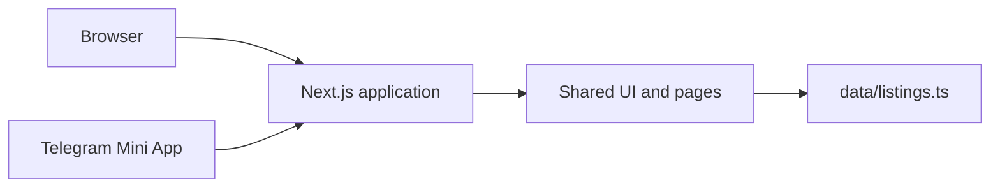

<p align="center">
  
</p>

<h1 align="center">Addis Market</h1>

<p align="center"><strong>Local products. Real people. Simple buying.</strong></p>

<p align="center">
  A mobile-first marketplace for Addis Ababa that runs as a website <em>and</em> as a Telegram Mini App.
</p>

<p align="center">
  
  
  
  
  
</p>

<p align="center">
  <a href="https://YOUR-VERCEL-DOMAIN.vercel.app"><strong>Live website</strong></a>
  ·
  <a href="https://t.me/YOUR-BOT/YOUR-APP-SHORT-NAME"><strong>Open in Telegram</strong></a>
  ·
  <a href="https://github.com/YOUR-USERNAME/addis-market"><strong>GitHub</strong></a>
</p>

<!-- Optional: add a screenshot at docs/screenshot.png, then remove these comment marks
<p align="center"></p>
-->

---

## Contents

- [Overview](#overview)
- [Features](#features)
- [Tech stack](#tech-stack)
- [Getting started](#getting-started)
- [Environment variables](#environment-variables)
- [Managing content](#managing-content)
- [Telegram Mini App setup](#telegram-mini-app-setup)
- [How the Telegram integration works](#how-the-telegram-integration-works)
- [Project structure](#project-structure)
- [Deployment](#deployment)
- [Security](#security)
- [Current scope](#current-scope)
- [Author](#author)

---

## Overview

Addis Market helps people in Addis Ababa discover, browse and share local products. Every listing shows the price in **ETB**, whether it is negotiable, the condition and the area, so buyers know what they are getting before they message a seller.

The same Next.js application serves both the website and the Telegram Mini App, so there is no separate Telegram frontend to maintain.



---

## Features

### Marketplace

| Area | What you get |
| --- | --- |
| **Home** | Hero slider (swipe, keyboard, arrows), About with animated stats, featured products, location map, Sell section, safety tips |
| **Navigation** | Smooth-scroll sections, sliding hover indicator, scroll-spy active state, mobile bottom bar |
| **Search** | Live search across product name, category, area, brand and seller, any word order |
| **Browse** | `/products` shows every product; `/listings` has filters and "See more" |
| **Filters** | Category, area, condition, max price, sort (newest, oldest, price), all kept in the URL |
| **Product page** | Photo gallery, price (negotiable or fixed), specifications, seller card, area map, related listings |
| **Favorites** | Heart on any product, `/favorites` page with a live count (saved in the browser) |
| **Sharing** | Web Share API, copy link, Share on Telegram |
| **Quality** | Responsive from 320px, keyboard accessible, SEO metadata per listing, custom 404 |

### Telegram Mini App

- Runs inside Telegram, and works unchanged in a normal browser
- Telegram Back Button on inner pages and Main Button on product pages
- **Open in Telegram** deep links that open the exact listing
- In Telegram, "Message seller" opens the seller's chat

---

## Tech stack

| Layer | Choice |
| --- | --- |
| Framework | Next.js (App Router), React, TypeScript |
| Styling | Plain CSS with design tokens (`app/globals.css`, `app/theme.css`) |
| Font and icons | Manrope, Lucide |
| Telegram | Telegram Web App SDK |
| Hosting | Vercel |

Listings come from typed local data. There is no database in this version.

---

## Getting started

Requires **Node.js 20 or newer**.

```bash
git clone https://github.com/YOUR-USERNAME/addis-market.git
cd addis-market
npm install
cp .env.example .env.local     # Windows PowerShell: Copy-Item .env.example .env.local
npm run dev
```

Open <http://localhost:3000>.

| Command | What it does |
| --- | --- |
| `npm run dev` | Development server |
| `npm run build` | Production build |
| `npm start` | Run the production build |
| `npx tsc --noEmit` | Type check |

---

## Environment variables

Create `.env.local` locally. On Vercel add the same names under **Settings → Environment Variables**, then redeploy.

| Variable | Required | Example | Purpose |
| --- | :---: | --- | --- |
| `NEXT_PUBLIC_SITE_URL` | Yes | `https://your-project.vercel.app` | Public URL, used for share links and previews |
| `NEXT_PUBLIC_TELEGRAM_BOT_USERNAME` | Yes | `AddisMarket27_Bot` | Your bot (no `@`) |
| `NEXT_PUBLIC_TELEGRAM_APP_SHORT_NAME` | Yes | `market` | Mini App short name from BotFather |
| `NEXT_PUBLIC_TELEGRAM_CONTACT_USERNAME` | Yes | `Yemaryamelij` | Telegram account opened by **Message us on Telegram** and **Help on Telegram** (no `@`) |
| `NEXT_PUBLIC_TELEGRAM_CHANNEL_URL` | No | `https://t.me/your_channel` | If set, the footer shows **Join us on Telegram** |

> **Never** put a bot token in a `NEXT_PUBLIC_*` variable. This version does not need the bot token at all. Variables are read at build time, so restart `npm run dev` or redeploy after changing them.

---

## Managing content

### Listings

Edit `data/listings.ts` (and `data/habesha.ts` for the Habesha dresses). Each listing has a title, price in ETB, `negotiable`, description, area, address, condition, seller, specs and `imageCount`.

### Photos

```text
public/listings/<listing-id>/1.jpg
public/listings/<listing-id>/2.jpg
```

`<listing-id>` is the listing's `id`. Set `imageCount` to the number of photos. File names must be lowercase `.jpg`. A missing photo shows a placeholder.

### Sellers

Each seller is defined once near the top of the data file: `S("Name", memberSinceYear, "telegram_username")`. The username is without `@`.

### Other images

| File | Used for |
| --- | --- |
| `public/brand/logo.svg` | Logo (header, footer, browser tab) |
| `public/about.jpg` | About section photo |
| `public/hero/1.jpg`, `2.jpg`, `3.jpg` | Hero slider photos |

### Categories and areas

`data/categories.ts` is the single source of truth. A category with no listings is hidden automatically.

---

## Telegram Mini App setup

1. **Create the bot.** In Telegram open **@BotFather**, send `/newbot` and save the bot username. Keep the token private.
2. **Create the Mini App.** Send `/newapp`, choose your bot, then set the title, description, **Web App URL** (your Vercel `https://` address) and the **short name** (for example `market`).
3. **Optional menu button.** Send `/setmenubutton` to add an open button in the bot chat.
4. **Set the environment variables** in the table above and redeploy.
5. **Open it:** `https://t.me/<bot-username>/<app-short-name>`

**Local testing:** Telegram needs `https`. Expose your dev server with a tunnel such as ngrok or Cloudflare Tunnel and use that address in BotFather. `http://localhost:3000` will not work in Telegram.

---

## How the Telegram integration works

| Action | Opens |
| --- | --- |
| Header Telegram button | The Mini App |
| **Open in Telegram** on a product | The Mini App on that listing: `…/<app>?startapp=<listing-id>` |
| **Message seller** on the website | The Mini App on that listing |
| **Message seller** inside Telegram | The seller's own chat |
| **Share on Telegram** | Telegram's share sheet with the website listing link |
| **Message us on Telegram** and **Help on Telegram** | The contact account from `NEXT_PUBLIC_TELEGRAM_CONTACT_USERNAME` |

- `lib/telegram.ts` holds every Telegram URL and a safe check for whether the app really runs inside Telegram.
- `components/TelegramBridge.tsx` initializes the Mini App (`ready()`, `expand()`), shows the Back Button on inner pages and opens `startapp` deep links. An unknown listing id simply stays on the home page.
- The same listing id is used everywhere: `/listings/<id>` on the web and `startapp=<id>` in Telegram.

---

## Project structure

```text
app/            Pages: /, /products, /listings, /listings/[id], /favorites, 404
components/     UI: header, footer, hero, product card, browser, Telegram bridge
data/           listings.ts, habesha.ts, categories.ts, areas.ts
lib/            telegram.ts, search.ts, utils.ts
public/         brand/, listings/, hero/, about.jpg
```

---

## Deployment

1. Push the project to GitHub.
2. Import the repository in [Vercel](https://vercel.com).
3. Add the environment variables.
4. Deploy, then copy the `https` address.
5. Use that address as the Web App URL in BotFather.
6. Open the Mini App from Telegram and test.

Every `git push` to `main` redeploys automatically.

---

## Security

- Telegram data such as `initDataUnsafe` is **untrusted**. It is never used for authorization.
- Public variables hold only the bot username, app name, site URL and contact username. No secrets.
- `.env.local` is git-ignored. Only `.env.example` is committed.
- If you add accounts, seller listing creation or payments later, validate Telegram `initData` on the server with the bot token.

---

## Current scope

**Included:** marketplace pages, search, filters, product pages, favorites, sharing, Telegram Mini App with deep links, Vercel deployment.

**Not included yet:** database, user accounts, seller-created listings, payments, admin dashboard. Sellers currently contact the team on Telegram, and listings are added in `data/listings.ts`.

---

## Author

**Abenezer Samson Zewdu**
Frontend Engineer & UI/UX Designer

<sub>Addis Market · © 2026</sub>